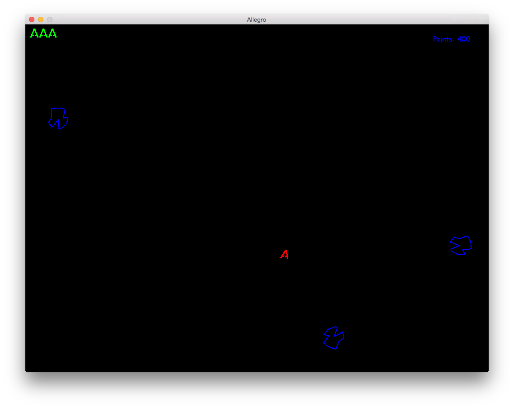
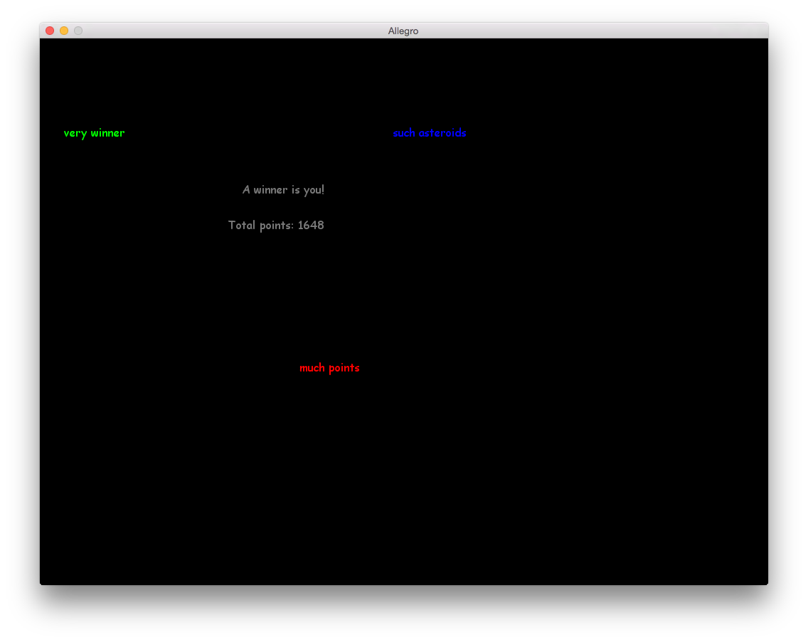

# Asteorids!

Just a simple project to mess around with C++ and allegro gaming library.
This is not to be considered a polished or production-ready product, just a prototype.

## Features:

* When the game starts a spaceship is created in the middle of the screen.

* If an asteroids touches the spaceship, one live will be subtracted and the spaceship will be respawned.

* The spaceship can't die in its first 2 seconds of life, even if an asteroid touches it.

* Asteroid randomly appear on screen.

* Game ends when either all the asteroids are destroyed or when the player loses the life.

## Screenshots:

* In game:

* Winning screen:

## Todos:

* Add a Player class that contains a Spaceship object.

* Makefile

* An asteroid should not be able to hurt a ship in the first second or so (in case it gets spawned too near the player).

* When an asteroid explodes, it should create smaller (and faster) asteroids.